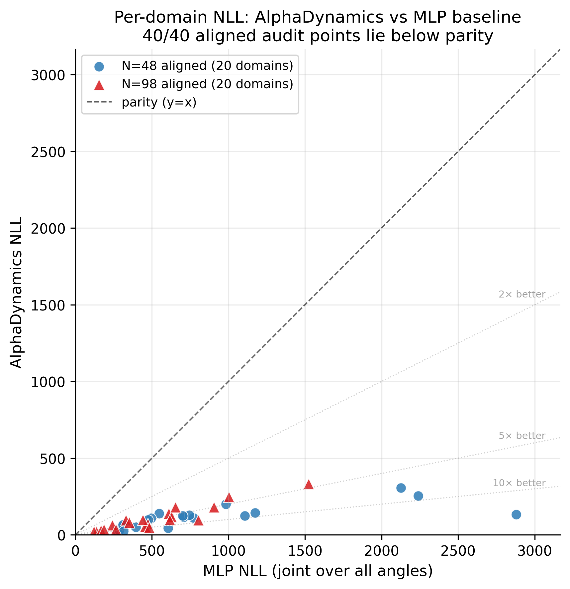

# AlphaDynamics

[](https://doi.org/10.5281/zenodo.19788564)
[](https://www.apache.org/licenses/LICENSE-2.0)
[](https://creativecommons.org/licenses/by/4.0/)

**Compact per-system neural surrogate for protein torsion dynamics.**

AlphaDynamics trains a small phase-flow model for one protein/domain from seed
MD and predicts the next-step distribution over backbone torsion angles. In the
current aligned mdCATH audit, it beats a matched MLP baseline on **40/40
domains** and produces stable 2500-step torsion rollouts.



## 30-second summary

- **Task:** learn a per-protein molecular-dynamics surrogate in φ/ψ torsion space.
- **Model:** coupled phase oscillators + neural ODE + mixture-of-von-Mises head.
- **Main result:** 20/20 wins at N=48 and 20/20 wins at N=98 against a matched MLP.
- **Rollout audit:** six 2500-step rollouts with Ramachandran free-energy metrics.
- **Scope:** per-system surrogate trained from seed MD, not a zero-shot sequence-to-dynamics model.

Why this may be useful: most protein-dynamics ML work focuses on large
transferable Cartesian models. AlphaDynamics tests a smaller complementary
route: a torus-native specialist model for one protein at a time.

**Author:** Krzysztof Gwozdz
**Started:** 2026-04-14
**Preprint DOI (v1, 2026-04-26):** [10.5281/zenodo.19791327](https://doi.org/10.5281/zenodo.19791327)
**Concept DOI (all versions):** [10.5281/zenodo.19788564](https://doi.org/10.5281/zenodo.19788564)

## Citation

If you use this work, please cite:

```bibtex
@misc{gwozdz2026alphadynamics,
  author       = {Gwóźdź, Krzysztof},
  title        = {{AlphaDynamics}: A compact per-system phase-flow surrogate
                  for protein torsion dynamics},
  year         = {2026},
  publisher    = {Zenodo},
  version      = {v1.0-preprint-2026-04-25},
  doi          = {10.5281/zenodo.19791327},
  url          = {https://doi.org/10.5281/zenodo.19791327}
}
```

## What it does

AlphaDynamics learns a fast surrogate of a specific protein trajectory. Given
seed MD data for one folded protein/domain, it trains a compact model that
predicts the next-step distribution in backbone torsion space and can generate
autoregressive rollouts for analysis.

It is not yet a zero-shot sequence-to-dynamics model. A future sequence- or
structure-conditioned version must be validated with sequence-identity splits
and external baselines before making that claim.

- Input: torsion angles (φ, ψ) of all residues at time t
- Output: mixture-of-von-Mises distribution over angles at time t+dt
- Core architecture: phase oscillators coupled via CNOT-style interactions,
  evolved by torchdiffeq RK4 adjoint ODE solver
- Model size: ~350K parameters per protein/domain for the v1 full-chain model
- Inference speed: ~16 ms per frame on RTX 5090

## Headline results

**Current publication-grade status:** the aligned audit is the defensible v1
result: 20 mdCATH domains at N=48, 20 domains at N=98, plus 3+3 aligned
rollout/free-energy audits. The converter now aligns φ and ψ by common residue
index and stores `residue_indices` and
`dihedral_alignment=common_residue_index`.

Validated aligned local inputs currently exist for 20 N=48 mdCATH domains at
348 K, 20 N=98 mdCATH domains at 348 K, and the matching all-temperature
rollout inputs. Smoke tests and short undertrained audits are excluded from the
public release; the shipped result tables below are the publication-grade
4000-step audits.

### Aligned mdCATH N≈50 audit — 20 domains, 4000 steps

Fresh phi/psi-aligned rerun on the 20 locally available N≈50 mdCATH domains
at 348 K:

| Domains | N used | Steps | Device | Win rate | Ratio of means | Mean ΔNLL |
|---:|---:|---:|---|---:|---:|---:|
| 20 | 48 | 4000 | CPU | **20/20** | **7.66×** | **-757.96** |

All 20 input `.npz` files have `dihedral_alignment=common_residue_index`.
Full table: [results/mdcath_aligned20_4000step_cpu.md](results/mdcath_aligned20_4000step_cpu.md).

### Aligned rollout free-energy audit — 3 domains, GPU

Fresh aligned 2500-step rollouts with `κ×30` on three representative domains:

| Domains | Training | Rollout | Mean JSD | Mean EMD | Mean \|ΔG_basin\| | Mean pop err |
|---:|---|---|---:|---:|---:|---:|
| 3 | 4000 steps, batch 512, CUDA | 2500 steps | 0.194 | 20.6° | 1.356 kcal/mol | 0.093 |

Ordered domains are good (`1lwjA03`, `1kwgA03`: JSD ≈ 0.14, population error
≈ 0.07). The disordered domain `1vq8L01` is the honest limitation
(JSD 0.300, EMD 35.9°, |ΔG_basin| 1.98 kcal/mol).

Full table: [results/ramachandran_aligned3_4000step_gpu.md](results/ramachandran_aligned3_4000step_gpu.md).

### Aligned N=100 scaling audit — 20 domains, GPU

Fresh aligned one-step NLL audit at the larger size class (N=98 common
residues, mdCATH 348 K), trained for 4000 steps per model with batch
256 on CUDA:

| Domains | Win rate | Mean MLP NLL | Mean PF_t4 NLL | Ratio of means |
|---:|---:|---:|---:|---:|
| 20 | **20/20 (100%)** | 519.5 | **102.2** | **5.08×** |

PhaseFlow $t_\text{max}=4$ wins all 20 domains. Best margins: `4ktyB04`
(9.8×), `2dhkA01` and `1w36F02` (8.3×). The full table with per-domain
identity, MLP, PF_t1, PF_t4 NLLs is in
[results/mdcath_aligned20_n100_4000step_gpu.md](results/mdcath_aligned20_n100_4000step_gpu.md).

### Aligned N=98 rollout free-energy audit — 3 domains, GPU

Fresh aligned 2500-step rollouts with `κ×30` on three representative N=98 domains:

| Domains | Training | Rollout | Mean JSD | Mean EMD | Mean \|ΔG_basin\| | Mean pop err |
|---:|---|---|---:|---:|---:|---:|
| 3 | 4000 steps, batch 128, CUDA | 2500 steps | 0.172 | 17.9° | 1.403 kcal/mol | 0.092 |

Two ordered domains are good (`4ktyB04`: JSD 0.127, pop err 0.059;
`1w36F02`: JSD 0.122, pop err 0.065). The disordered domain
`2hoxA01` is the honest limitation (JSD 0.266, EMD 30.1°,
|ΔG_basin| 2.19 kcal/mol, pop err 0.151).

Rollout fidelity at N=98 is **marginally better** than at N=48 (N=48
mean JSD 0.194 vs N=98 mean JSD 0.172), suggesting AlphaDynamics scales
to larger proteins without rollout degradation.

Full table: [results/ramachandran_aligned3_n98_4000step_gpu.md](results/ramachandran_aligned3_n98_4000step_gpu.md).

Release/audit documentation:
- [docs/AUDIT_MANIFEST_2026_04_25.md](docs/AUDIT_MANIFEST_2026_04_25.md)
- [docs/PREPRINT_PACKAGE_2026_04_25.md](docs/PREPRINT_PACKAGE_2026_04_25.md)

## Empirical laws observed

**Law 1 — Warmup time matches protein scale:**
Optimum ODE integration time t_max depends on chain length N and data
temporal correlations. Historical runs favored t=4 on the N≈50 mdCATH
benchmark, but the aligned 100-step audit favored t=1 on the five local
domains. Treat t_max as a hyperparameter until the full aligned rerun
settles it.

**Law 2 — Advantage scales with protein ordering:**
The win ratio (MLP NLL / AlphaDynamics NLL) is inversely proportional to
the identity baseline (natural frame-to-frame change). Well-ordered
proteins (small step) give the largest advantage. Fast/disordered proteins
(large step) give smaller advantage but AlphaDynamics still wins.

## Architecture

```
dφ_i/dt = ω_i + Σ_j W_ij · cos(φ_j) · sin(φ_j − φ_i) + a · sin(φ_anchor_i − φ_i)
```

- **ω_i**: prime-based natural frequencies [2.11, 1.31, 0.67, 0.31, 0.17] rad/s
  cycled across N oscillators (incommensurable → no mutual resonance,
  KAM-friendly)
- **W_ij**: learnable asymmetric N×N coupling matrix (CNOT-inspired
  efficient decomposition)
- **φ_anchor_i**: golden phyllotaxis (2π/φ²·i mod 2π − π) — Weyl
  equidistribution on S¹, breaks symmetry heterogeneously
- **Integrator**: torchdiffeq RK4 adjoint, integration horizon t_max (tuned)
- **Output head**: 8-component mixture of von Mises densities on T^N
  (axis-independent within each mixture component)

## Directory layout

```
AlphaDynamics/
├── README.md                            — this file
├── requirements.txt
├── src/                                 — model + training + eval code
│   ├── alphadynamics_cli.py               — product CLI (doctor/validate/train/rollout/baselines/report)
│   ├── chain_model.py                     — ChainMLP + ChainPhaseFlow
│   ├── train_real.py                      — ChainPhaseFlowVar + training utilities
│   ├── train_chain.py                     — chain training helpers
│   ├── chain_md.py                        — synthetic Langevin MD generator
│   ├── rollout_eval.py                    — autoregressive rollout + metrics
│   ├── ramachandran_energy_v2.py          — Ramachandran free-energy audit
│   ├── mdcath_convert_v3.py               — mdCATH HDF5 → aligned dihedral npz
│   ├── mdcath_convert_alltemps.py         — multi-temperature converter
│   ├── mdcath_benchmark.py                — aligned mdCATH benchmark runner
│   └── run_aligned5_benchmark.sh          — reproducible 5-domain audit
├── paper/
│   ├── main.md                            — manuscript source
│   ├── main.pdf                           — compiled preprint
│   ├── references.bib
│   ├── make_figures.py
│   └── figures/                           — fig1/fig2/fig3 + 6 ramachandran panels
├── results/                             — aligned audit artifacts
│   ├── mdcath_aligned20_4000step_cpu.{json,md}      — N=48 NLL (20 domains)
│   ├── mdcath_aligned20_n100_4000step_gpu.{json,md} — N=98 NLL (20 domains)
│   ├── ramachandran_aligned3_4000step_gpu.{json,md} — N=48 rollout (3 domains)
│   └── ramachandran_aligned3_n98_4000step_gpu.{json,md} — N=98 rollout (3 domains)
├── docs/                                — preprint package & closeout notes
│   ├── PREPRINT_PACKAGE_2026_04_25.md
│   ├── RESEARCH_CLOSEOUT_2026_04_24.md
│   └── AUDIT_MANIFEST_2026_04_25.md
└── data/                                — how to obtain mdCATH (raw not committed)
```

## Reproducing results

```bash
pip install -r requirements.txt

# 1. Download mdCATH domains into mdcath_raw/data/
# Example shown in data/README.md via huggingface_hub

# 2. Convert HDF5 → aligned dihedrals
python src/mdcath_convert_v3.py \
  --bench_dir mdcath_raw \
  --out_dir mdcath_real_data/mdcath_348K

# 3. Run an audit benchmark without overwriting historical tables
python src/mdcath_benchmark.py \
  --data_dir mdcath_real_data/mdcath_348K \
  --out_prefix mdcath_aligned5_results \
  --device cpu

# Or run the aligned five-domain audit end to end
DEVICE=cpu STEPS=4000 BATCH=512 src/run_aligned5_benchmark.sh

# 4. Ramachandran free-energy rollout audit
python src/ramachandran_energy_v2.py
```

## CLI MVP

The product wrapper keeps the audited scripts behind one command surface:

```bash
# Optional editable install gives the `alphadynamics` command
pip install -e .

# Check environment, dependencies, CUDA, and shipped audit artifacts
alphadynamics doctor

# Validate the aligned torsion data contract
alphadynamics validate-data \
  --data-dir mdcath_real_data/mdcath_348K \
  --strict

# Convert mdCATH H5 files to aligned torsion npz
alphadynamics convert \
  --bench-dir mdcath_raw \
  --out-dir mdcath_real_data/mdcath_348K

# Train/evaluate the one-step NLL benchmark
alphadynamics train \
  --data-dir mdcath_real_data/mdcath_348K \
  --out-prefix mdcath_aligned20_4000step_cpu \
  --steps 4000 \
  --batch 512 \
  --device auto

# Train rollout model and evaluate Ramachandran free-energy fidelity
alphadynamics rollout \
  --data-dir mdcath_real_data/mdcath_alltemps \
  --out-prefix ramachandran_aligned3_4000step_gpu \
  --domains 1lwjA03 1kwgA03 1vq8L01 \
  --steps 4000 \
  --batch 512 \
  --device auto

# Extend rollout research with a kappa calibration sweep
alphadynamics kappa-sweep \
  --data-dir mdcath_real_data/mdcath_alltemps \
  --out-prefix kappa_sweep_n48 \
  --domains 1lwjA03 1kwgA03 1vq8L01 \
  --kappa-mult 1 5 10 20 30 50 \
  --device auto

# Audit against a stronger residual/autoregressive MLP baseline
alphadynamics strong-baseline \
  --data-dir mdcath_real_data/mdcath_348K \
  --out-prefix strong_baseline_audit \
  --steps 4000 \
  --batch 256 \
  --seeds 42 43 44 \
  --device auto

# Audit against a true temporal baseline with an 8-frame GRU context
alphadynamics temporal-baseline \
  --data-dir mdcath_real_data/mdcath_348K \
  --out-prefix temporal_gru_3dom_3seed_4000step_cuda \
  --domains 1lwjA03 1kwgA03 1vq8L01 \
  --window 8 \
  --steps 4000 \
  --batch 128 \
  --seeds 42 43 44 \
  --phaseflow-tmax 4 \
  --device auto

# Prepare a small shared-dataset audit on Microsoft's public Timewarp data
alphadynamics timewarp-comparison list \
  --dataset 4AA-large \
  --split test \
  --limit 10

alphadynamics timewarp-comparison convert \
  --dataset 4AA-large \
  --split test \
  --max-domains 3 \
  --max-frames 2500 \
  --out-dir timewarp_real_data/4AA-large_test

# Build compact Markdown summary from existing JSON result files
alphadynamics report \
  --output results/alphadynamics_audit_report.md
```

Every execution subcommand supports `--dry-run` to print the underlying audited
script call before launching a long job.

The productization plan and research expansion ladder are documented in
[docs/PRODUCT_V1_2026_04_28.md](docs/PRODUCT_V1_2026_04_28.md).
The reviewer hardening checklist is tracked in
[docs/REVIEWER_RISK_REGISTER_2026_04_28.md](docs/REVIEWER_RISK_REGISTER_2026_04_28.md).

## Related work

- **AlphaFold 2/3** (DeepMind) — static structure prediction (different task).
- **Timewarp** (Klein et al., NeurIPS 2023, Microsoft) — Cartesian normalizing
  flow for peptide dynamics (396M params).
- **AlphaFlow / ESMFlow** (Jing et al., MIT, 2024) — flow matching on
  conformational ensembles (different task).
- **MDGen** (Jing et al., MIT, 2024) — autoregressive MD in Cartesian.
- **AlphaFold-MSA-subsampling** (Wayment-Steele et al.) — hack AF2 via
  reduced MSA to get ensembles (different task: states, not trajectories).
- **AlphaFold-Metainference** (Vendruscolo lab, Cambridge 2024) — NMR-
  restrained ensemble from AF2.

AlphaDynamics occupies a distinct niche: **continuous temporal propagation
of torus dynamics** with minimal parameters and ODE-based inductive bias.

## Status

- [x] Historical mdCATH 37-domain unified benchmark at N≈50 — superseded by aligned subset
- [x] Historical mdCATH 20-domain scaling benchmark at N≈100 — superseded by aligned N=98 rerun
- [x] Aligned mdCATH N≈50 benchmark subset — 20 domains, 20/20 wins
- [x] Cross-temperature all-temperature data regenerated with alignment metadata
- [x] Rollout stability test (no explosion, moderate distribution preservation)
- [x] Aligned rollout/free-energy audit — 3 N=48 domains, κ×30
- [x] Aligned N=98 scaling audit — 20 domains, 20/20 wins, 5.08× ratio
- [x] Aligned N=98 rollout audit — 3 domains, comparable fidelity to N=48
- [x] Converter fixed to align φ/ψ by residue index
- [x] CLI MVP wrapper — convert, train, rollout, report
- [x] Product CLI wrapper — doctor, validate-data, kappa-sweep, strong-baseline, temporal-baseline, timewarp-comparison, report
- [x] Editable package metadata — `pip install -e .` exposes `alphadynamics`
- [x] v1 preprint package prepared — aligned 20+20 NLL and 3+3 rollout audit
- [x] 3-domain, 3-seed residual baseline sanity check — 9/9 PhaseFlow wins
- [ ] Remaining N≈50 aligned rerun domains, if raw H5 files are downloaded
- [ ] Temporal GRU baseline audit on representative 3-domain subset
- [ ] AlphaDynamics shared-dataset audit on public Timewarp tetrapeptides
- [ ] Full 40-domain temporal GRU baseline audit
- [ ] Rollout κ calibration sweep
- [ ] Rollout fidelity without κ-rescaling or honest v1 limitation
- [ ] Scaling to N=150, N=200 residues
- [ ] Direct head-to-head vs Timewarp, AlphaFlow, bioEmu
- [ ] CASP Refinement targets (CASP15 / CASP16)
- [ ] arXiv preprint
- [ ] NeurIPS ML4Sci / ICLR workshop submission

## Data

Raw mdCATH trajectories are not committed (3.3 TB total, 200 MB per
domain). See `data/README.md` for download instructions via Hugging Face
`compsciencelab/mdCATH` and for the aligned `.npz` file format used by the
audited benchmarks.

## License

Source code is licensed under the Apache License 2.0; see `LICENSE`.
The manuscript, paper figures, result tables, and documentation are licensed
under CC BY 4.0; see `LICENSE-MANUSCRIPT.md`.

## Citation

Please cite the Zenodo v1 preprint:

```bibtex
@misc{gwozdz2026alphadynamics,
  author       = {Gwóźdź, Krzysztof},
  title        = {{AlphaDynamics}: A compact per-system phase-flow surrogate
                  for protein torsion dynamics},
  year         = {2026},
  publisher    = {Zenodo},
  version      = {v1.0-preprint-2026-04-25},
  doi          = {10.5281/zenodo.19791327},
  url          = {https://doi.org/10.5281/zenodo.19791327}
}
```
